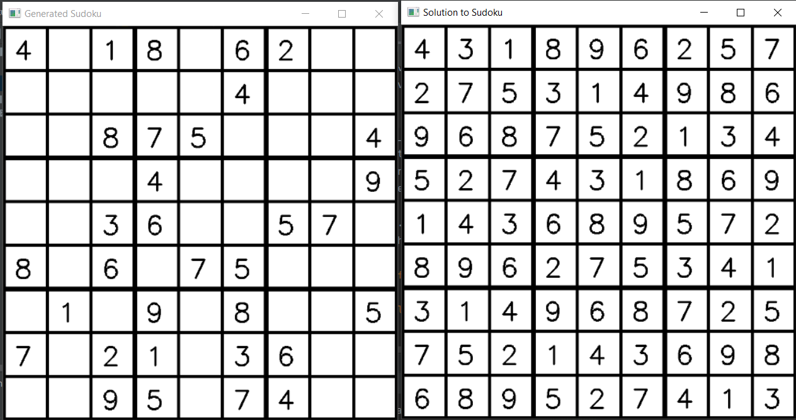

This repository is where I put all of the scripts I have for solving and creating sudokus. Both current scripts can be used independently of eachother

# Sudoku Solver

sudoku_solver.py can be used to solve sudokus of 4x4, 9x9, 25x25, etc.

In order to use the script, you have to manually input the sudoku at the bottom of the script (after __ __name__ __='__ __main__ __'). Further down are some examples of sudoku's, which you can solve by replacing the sudoku in __ __name__ __='__ __main__ __' with them.

Be aware that sudokus that require a lot of backtracing (a sort of directed brute force method) instead of traditional sudoku solving methods, can take a long time.

# Sudoku Creator
sudoku_creator.py can be used to create 9x9 sudokus, and displays them and one of their solutions

In order to use this script, you have to manually input how many blocks you want to remove in percentage, after __name__='__main__', in s=CreateSudoku(x), where x=[0,1]. The higher the number, the more empty square your eventual puzzle will have, the harder it will become.

